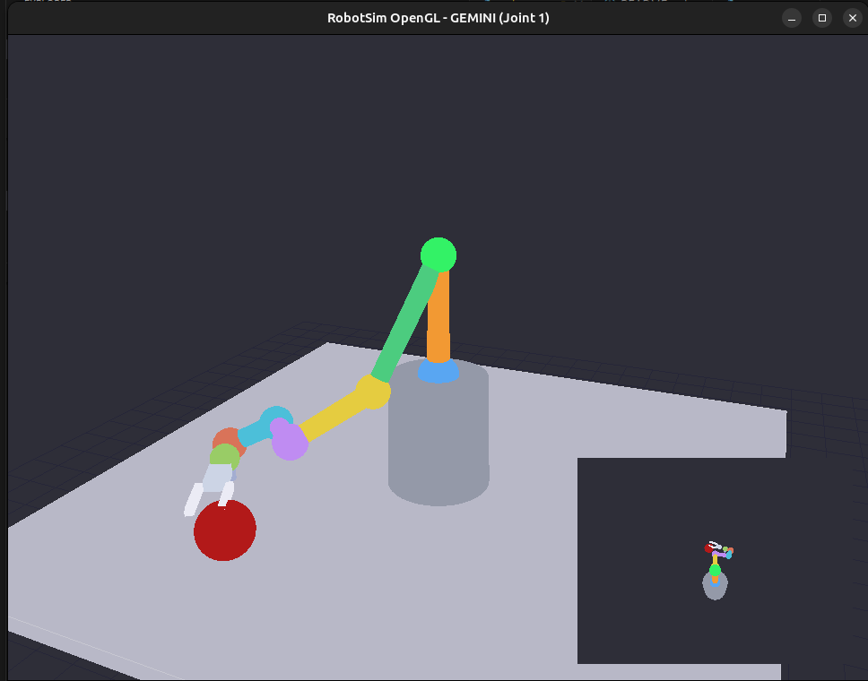

# RobotSim2: Breathing New Life into My M.Sc. Robot Simulator

*How a retro 1999 demonstrator turned into a modern OpenGL playground with inverse kinematics, Gemini Robotics perception, and a configurable arm.*

---

## 🎬 Setting the Scene

Back in the late 1990s, I built the original **RobotSim** as a Visual Studio demonstrator for my master’s thesis—a six degree-of-freedom Cartesian robot that showed prospective classmates what industrial manipulators could do. It ran flawlessly on CRT monitors, but time (and Windows APIs) moved on. When I recently dusted off the binaries, nostalgia surfaced along with a challenge: could I rebuild RobotSim from scratch using Python, modern OpenGL, and today’s AI tooling?

That journey became **RobotSim2**, and it was far more than a port. The project evolved into a full-fledged robotics sandbox, complete with inverse kinematics, configurable joints, a head-mounted virtual camera, and optional Gemini Robotics perception for automatic target acquisition.



---

## 🧭 Why Start Over?

Legacy C++ code, vendor-specific graphics APIs, and hard-coded robot parameters made maintenance painful. To keep RobotSim relevant, I needed:

- **Modern tooling** – Python’s scientific stack (NumPy, PyOpenGL) for rapid iteration.
- **Hardware flexibility** – Ability to simulate robots with different degrees of freedom.
- **Perception integration** – Hook into machine-vision services like Gemini Robotics.
- **Shareability** – A project others can run with `pip install -e .[dev]` and operate on Linux, macOS, or even inside CI.

---

## 🧱 Core Architecture

RobotSim2 is deliberately modular:

- `robot.py` encapsulates the kinematics model, forward/inverse solvers, and Jacobians.
- `controllers.py` provides manual jogging and trajectory followers.
- `ogl_app.py` runs the interactive OpenGL viewer, including a top camera and hand-camera inset.
- `gemini_agent.py` integrates with Google’s Gemini Robotics models for perception-guided poses.
- `tests/` houses a Pytest suite that exercises kinematics, orientation search, and prompt parsing.

Everything is pure Python, so students and hobbyists can read the code without jumping between languages.

---

## 🔧 Rebuilding the Arm — Now with Dynamic DOF

One of the most satisfying upgrades was making the arm’s joint count configurable. In the original demo, everything assumed six joints. Today, edge devices and smaller manipulators often use four or five. RobotSim2 now exposes `--joint-count` on both the CLI demo and the OpenGL viewer:

```bash
robot-sim-ogl --joint-count 4 --auto
```

Behind that tiny flag lies a cascade of updates:

1. `RobotModel` dynamically slices link lengths, axes, and limit tables to match the requested DOF.
2. Manual controllers enforce velocity vectors of the correct size.
3. The OpenGL renderer highlights the selected joint without crashing when an index is out of range.
4. The Gemini prompt automatically references the active joint count so the language model mirrors reality.

Being able to flip between 3–6 DOF configurations has already made the simulator more useful for hardware planning conversations.

---

## 🤖 Gemini Robotics Integration

The second major pillar is perception. The optional Gemini agent captures the overhead camera image, sends it to Google’s Gemini Robotics model, and converts pixel detections into world coordinates. RobotSim2:

- Projects detections into the workspace with camera intrinsics.
- Validates the fingertip target with inverse kinematics using damped least squares.
- Streams the request/response cycle and hover pose metadata to disk when debugging.

Most importantly, the Gemini prompt is now a format string that references the active DOF. We even had to double-escape the JSON braces— a subtle detail that once caused a `KeyError: "point"` until we corrected the template.

---

## 🎨 UI & UX Enhancements

- **Top camera repositioning** and **target scaling** give the model better visibility.
- The viewer displays status messages when joints or trajectories fail, making it clear why a pose isn’t reachable.
- Gemini single-shot mode runs automatically after a reset, with logs that trace every mapping source (table bounds vs. camera projective).

---

## ✅ Quality Gates

Every major refactor went through the same checklist:

1. `python -m compileall robot_sim_py`
2. `pytest`

All 15 tests pass, and the project runs smoothly on a Linux OpenGL stack. By keeping unit coverage high, I’ve been able to iterate on the GPU pipeline without worrying about regression in the math.

---

## 🧪 Lessons Learned

- **Escape all the braces.** Python’s `str.format` combined with JSON templates can lead to hilarious errors in the middle of API calls.
- **Keep prompts aligned with state.** Sharing the robot’s true DOF with Gemini drastically reduced off-target suggestions.
- **Doc early, doc often.** Updating the README with instructions, flags, and screenshots means I don’t have to re-explain the setup to every collaborator.

---

## 🚀 How to Explore RobotSim2 Yourself

```bash
# Create and activate an environment
conda create -n robotsim python=3.10 -y
conda activate robotsim

# Install dependencies
pip install -e .[dev]

# Run the headless demo
robot-sim-demo --duration 6 --joint-count 5

# Launch the OpenGL viewer with Gemini integration
env GEMINI_API_KEY=... robot-sim-ogl --gemini --joint-count 6 --gemini-mode single
```

Try combining the joint-count flag with Gemini single-shot mode and watch the arm adapt to different kinematic chains.

---

## 🛣️ What’s Next?

- **Physics-backed simulation** using Bullet or MuJoCo for contact modeling.
- **WebGL port** for browser-friendly demos.
- **Dataset generation** by scripting Gemini queries and collecting camera frames.
- **Integration with VLA agents** for natural-language-controlled manipulation.

---

## 📝 Final Thoughts

Rebuilding RobotSim has been an emotional return to my academic roots and a technical deep dive into modern robotics tooling. The project now bridges past and present: the nostalgia of a thesis-day demo fused with the power of today’s AI ecosystem. If you want to experiment with manipulators, perception, or just relive some late-90s engineering joy—RobotSim2 is ready on GitHub.

👉 https://github.com/dexmac221/RobotSim2
